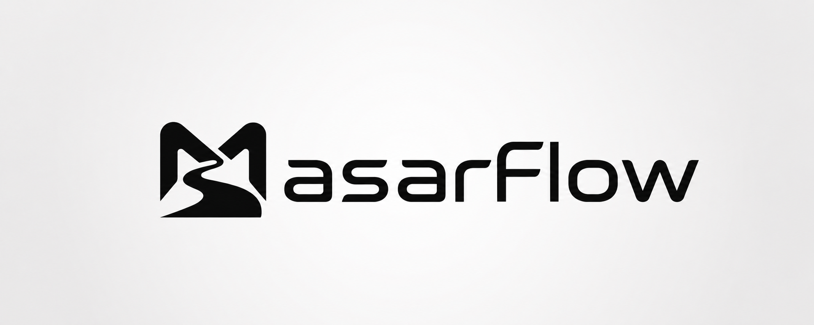

<p align="center">
  
</p>

**A local-first, AI-native project workspace.** Everything lives in your browser — notes, tasks, specs, canvases, and chat threads — backed by a local Python sidecar for embeddings, semantic search, and RAG context. No account. No cloud. No telemetry.

<p align="center">
  
  
  
  
  
  
</p>

---

## Table of contents

- [Features](#features)
- [Why local-first](#why-local-first)
- [Architecture](#architecture)
- [Tech stack](#tech-stack)
- [Getting started](#getting-started)
- [Configuration](#configuration)
- [Testing](#testing)
- [Scripts](#scripts)
- [Desktop launcher](#desktop-launcher)
- [Project structure](#project-structure)
- [Security](#security)

---

## Features

### Knowledge & documentation

- **Brain** — Markdown notes with wikilinks, backlinks, templates, slash commands, and a live-rendered CodeMirror editor.
- **Canvas** — infinite board with text, note, media, web-embed, and group nodes; Obsidian `.canvas` import/export; AI-operable tools.
- **Knowledge graph** — d3-force visualization of notes, entities, and their links.
- **Docs & Dev Logs** — documentation hub with PDF export and a chronological activity timeline.

### Planning & delivery

- **Tasks / Sprints / Specs / Standards** — kanban board, sprint velocity tracking, spec editor, and a regex-based standards enforcer.
- **Agents & Workflow** — agent roster with run inspector and a 16-step agentic pipeline runner.
- **Dashboard** — project health metrics, activity, and a GitHub commit feed.

### AI assistant

- **Chat** — three interchangeable backends, switchable per-chat from the header (or set a default in Settings → Chat):
  - **OpenCode** — the full agentic experience: the chat runs on a headless OpenCode server (`opencode serve`) with fs/shell/bash tools, per-action approvals, and persistent sessions (undo, resume after refresh). The workspace functions (create_note, read_spec, create_task, …) are installed as real OpenCode custom tools, so the model reads and mutates your MasarFlow project through the same functions the other backends use.
  - **API** — a saved AI connection (OpenAI, Anthropic, OpenRouter, Groq, …); keys live in your browser and are proxied same-origin. Workspace + linked-folder tools run through the in-browser Agent Loop.
  - **Local (Ollama)** — your local Ollama server, no API key.
  Every backend has two modes: **Agentic** — grounded in the live workspace, acts via tools (max iterations/runtime/tool time/shell commands/file writes, all configurable in Settings → Agent Loop); **Chat** — direct conversation, no context injection. `@`/`/`/`#` mentions, tool-calling, image attachments, and voice input work on all backends.
- **Linked projects (agentic coding)** — attach an external folder (e.g., a web app, a Unity game, or a desktop tool) and the AI gets sandboxed filesystem/shell tools on it, opencode-style: `fs_list`, `fs_read`, `fs_search` run freely; `fs_write` and `shell_run` require per-action approval.
- **Semantic search** — global Fuse fuzzy search plus vector similarity search through the Python service.

### Integrations

- **Sync** — two-way Obsidian vault sync.
- **Watcher** — live filesystem event feed over SSE.
- **Files** — synced-file index.
- **GitHub** — commit feed and spec extraction (PAT used server-side only).
- **Plugins** — catalog with toggles, settings, and widget slots.

## Why local-first

- **Your data stays yours.** All workspace data lives in IndexedDB (Dexie) in your browser — no servers, no accounts, no telemetry.
- **API keys never leave your machine.** Keys are stored in `localStorage` and sent only to the same-origin proxy route.
- **Works offline.** The UI is fully functional without network access; only model calls require connectivity.

## Architecture

```
┌──────────────────────────── Browser ────────────────────────────┐
│                                                                │
│  React UI (src/components) ── Zustand stores ── Dexie (IndexedDB)│
│        │                              ▲                        │
│        │ /api/chat proxy (NDJSON)     │ repos                  │
│        ▼                              │                        │
│  Next.js server (src/app) ────────────┘                        │
│     │                 │                                        │
│     │ /api/python/*   │ /api/fs/* (sandboxed)                  │
└─────┼─────────────────┼────────────────────────────────────────┘
      ▼                 ▼
┌─────────────────┐  ┌───────────────────────────────────────────┐
│ Python sidecar  │  │ Linked external projects                   │
│ FastAPI +       │  │ path-sandboxed fs_read/fs_write + shell    │
│ sentence-       │  │ per-action user approval                   │
│ transformers +  │  └───────────────────────────────────────────┘
│ Chroma          │
└─────────────────┘
```

The AI layer is agentic: an **AgentController** runs the model↔tool loop (context assembly → LLM → tool call → tool result → LLM → final answer) with configurable safety limits, cancellation, and lifecycle streaming, over a hand-rolled NDJSON streaming proxy at `api/chat` (OpenAI + Anthropic wire formats, explicit `tool_choice`, degradation ladder, first-byte/idle/total watchdogs).

**One tool layer, three backends.** Every backend drives the same workspace functions — `create_note`, `read_spec`, `create_task`, … (defined once in `src/lib/ai/workspace-tool-defs.ts`). API/Local backends execute them in the browser against the Dexie repos through the Agent Loop; the OpenCode backend gets them installed as real OpenCode custom tools (`.opencode/tools/*.ts`, regenerated by `start.mjs`) whose `execute()` calls back into `api/opencode/ws-call`. The server relays the call to the open chat tab over SSE (`api/opencode/bridge`), the browser executes the same `executeWorkspaceTool` (undo/dev-log/wikilinks included) and posts the result back — so a note created by the OpenCode backend lands in IndexedDB exactly like one created by the API backend. OpenCode's native fs/shell/web tools stay available for code work on disk and linked projects.

## Tech stack

| Layer | Technology |
| --- | --- |
| Framework | Next.js 16 (App Router) · React 19 · TypeScript |
| Styling | Tailwind CSS v4 · shadcn/ui |
| State & storage | Dexie (IndexedDB) · Zustand · Zod |
| Editor & viz | CodeMirror 6 · @xyflow/react (canvas) · d3-force (graph) · mermaid |
| AI | Streaming proxy with multi-provider support (OpenAI, Anthropic, OpenRouter, Groq, Ollama) |
| Python sidecar | FastAPI · sentence-transformers · Chroma DB · uvicorn |
| Desktop launcher | Electron · electron-vite · React 19 · Tailwind CSS v4 · xterm.js + node-pty |
| Testing | Vitest · Playwright · pytest |

## Getting started

### Requirements

- **Node.js 22.6+** (the OpenCode workspace-tool installer uses Node's built-in TypeScript support; older versions warn and skip the tools)
- **pnpm** (the package manager this project uses — `npm install -g pnpm` or `corepack enable pnpm`)
- **Python 3.11+** on PATH (for the local AI service)

### Installation

```bash
# 1. Install dependencies
pnpm install

# 2. Create the Python virtual environment and install requirements
pnpm run setup:python

# 3. Configure the environment
cp .env.local.example .env.local
```

### Development

```bash
pnpm run dev:full   # Next.js dev server + Python service + OpenCode server side by side
```

Open http://localhost:3000. The workspace shell waits until the Python service is healthy before loading; `dev:full` starts it automatically (the first embedding request downloads the ~90 MB `all-MiniLM-L6-v2` model). The chat system runs on a headless OpenCode server (`opencode serve`), which `dev:full` also starts for you on `http://127.0.0.1:4096` (falling forward to the next free port if 4096 is occupied, e.g. by Kilo Code) — or you can run `opencode serve` yourself and set `OPENCODE_AUTO_START=false`.

No setup is needed for the AI workspace functions (create_note, read_spec, …): `dev:full` and `start` install them as OpenCode custom tools automatically before spawning the server. The one case that needs a manual step is **running your own `opencode serve`**: run `pnpm run tools:install` once, then **restart** the server so it registers the tools (tools load only at server start). If a chat thread reports "The OpenCode server is missing MasarFlow's workspace functions", that's the fix.

### Production

```bash
pnpm run build
pnpm start   # launches `next start` + uvicorn (+ opencode serve)
```

## Configuration

Environment variables live in `.env.local` (see `.env.local.example`):

| Variable | Default | Purpose |
| --- | --- | --- |
| `PYTHON_SERVICE_URL` | `http://127.0.0.1:8000` | Base URL of the local Python AI service. Change only if you run it on a different port. |
| `OPENCODE_BASE_URL` | `http://127.0.0.1:4096` | Base URL of the OpenCode server (chat agent backend). Overridden by `start.mjs` with the port actually bound. |
| `OPENCODE_USERNAME` / `OPENCODE_PASSWORD` | *(empty)* | HTTP basic-auth credentials the backend uses to talk to the OpenCode server. |
| `OPENCODE_SERVER_USERNAME` / `OPENCODE_SERVER_PASSWORD` | *(empty)* | Auth applied to the server spawned by `start.mjs` (falls back to `OPENCODE_PASSWORD`). |
| `OPENCODE_AUTO_START` | `true` | Spawn `opencode serve` from `start.mjs` when nothing is reachable at `OPENCODE_BASE_URL`. |
| `OPENCODE_PORT` | `4096` | Preferred port for the spawned server (falls forward when occupied). |
| `OPENCODE_WORKSPACE_DIR` | project root | Default working directory for OpenCode sessions. Linked projects (chat → linked folder) use their own root instead. |
| `OPENCODE_PERMISSION_EDIT/BASH/WEBFETCH` | `ask` | Per-session tool permission rules (`ask` shows approvals in the chat UI; `allow`/`deny` bypass them). |
| `MASARFLOW_OPENCODE_FIRST_EVENT_TIMEOUT_MS` / `IDLE_TIMEOUT_MS` / `TOTAL_TIMEOUT_MS` | 30 s / 60 s / 300 s | Turn watchdogs for the OpenCode event stream. |
| `OPENCODE_MODEL_CACHE_TTL_MS` | 60 s | Cache TTL for the provider/model catalog fetched from OpenCode. |
| `MASARFLOW_BRIDGE_URL` | `http://127.0.0.1:3000` | Base URL the generated OpenCode workspace tools call back to. |
| `MASARFLOW_BRIDGE_SECRET` | *(auto-generated)* | Shared secret authenticating the OpenCode workspace tools to the bridge routes. `start.mjs` generates one and stores it in `.masarflow/bridge-secret`. |
| `OPENCODE_TOOLS_GLOBAL` | `true` | Also install the workspace tools into `~/.config/opencode/tools/` (covers manually-started OpenCode servers from any directory). |

The services bind to loopback only. Provider API keys are managed by OpenCode itself (`opencode auth` / its config) and never leave the machine.

## Testing

```bash
pnpm run lint        # ESLint (Next.js + TypeScript rules)
pnpm run typecheck   # tsc --noEmit
pnpm test            # Vitest unit tests (tests/unit/)
pnpm run e2e         # Playwright end-to-end (run `pnpm run build` first)
cd python-service && .venv/Scripts/python -m pytest   # Python service tests
```

## Scripts

| Script | Purpose |
| --- | --- |
| `pnpm run dev` | Next.js dev server (webpack) |
| `pnpm run dev:full` | Dev server + Python service + OpenCode server, side by side |
| `pnpm run build` / `pnpm start` | Production build / launcher (Next + Python) |
| `pnpm run setup:python` | Create the Python venv and install requirements |
| `pnpm run tools:install` | (Re)generate the OpenCode workspace-tool files (project + global dirs); restart `opencode serve` afterwards |
| `pnpm run lint` | ESLint (flat config, Next core-web-vitals + TS) |
| `pnpm run typecheck` | `tsc --noEmit` |
| `pnpm run format` / `format:check` | Prettier write / check |
| `pnpm test` | Vitest unit tests (`tests/unit/**/*.test.ts`) |
| `pnpm run e2e` | Playwright smoke tests |
| `pytest` (in `python-service/`) | Python service tests |
| `pnpm run desktop:dev` | Desktop launcher in development (electron-vite, hot reload) |
| `pnpm run desktop:build` / `desktop:start` | Build / run the desktop launcher |
| `pnpm run desktop:dist` | Package the launcher (NSIS installer + portable exe) |
| `pnpm run desktop:typecheck` | Launcher typecheck (`tsc --noEmit`) |

## Desktop launcher

A local-first companion app (`desktop/`) that wraps the whole project — no
terminal window needed:

- **Setup** — checks Node.js, pnpm, Python, `node_modules`, `.env.local`, and
  the Python venv, and installs whatever is missing (with live output in a
  built-in terminal). Runs automatically on first launch.
- **Run** — Development (`dev:full`) and Production (`build` → `start`)
  mode switch, live status chip, port health indicators, open-in-browser,
  and Stop (kills the whole process tree).
- **Configuration** — a form for every `.env.local` variable plus launcher
  settings (target directory, auto-open browser, terminal font size) and a
  full **Appearance** panel: Light / Dark / AMOLED / System color scheme,
  solid or gradient accent style with presets and a custom gradient editor,
  corner radius, UI scale, and logo color/background modes.
- **Testing** — one-click `lint`, `typecheck`, `test`, `e2e`, and Python
  `pytest` runs, each streaming to its own terminal tab with pass/fail badges.
- **Terminal** — collapsible panel with a tab per session and an interactive
  shell (real PTY: ANSI colors, Ctrl-C, resize-aware).
- **System tray** — the launcher keeps running in the Windows notification
  area when you close the window. Right-click the tray icon for quick
  actions: show the launcher, run/stop/build the app, open it in the
  browser, jump to a page, or exit.

The interface mirrors the MasarFlow web UI — same dark theme, default white
accent, components, and fonts (the accent, gradient, radius, and scale all
sync with the launcher's appearance settings).

```bash
pnpm run desktop:dev        # launcher in development (hot reload)
pnpm run desktop:dist       # package NSIS installer + portable exe into desktop/dist/
```

Copy the portable exe anywhere inside the repo tree (e.g.
`release/MasarFlow.exe`) and it finds the workspace automatically — a plain
desktop shortcut just works. See `desktop/README.md` for details.

## Project structure

```
src/
  app/            App Router: (workspace) routes + /api proxy routes
  components/     Feature components per module + ui/ primitives
  lib/
    ai/           Agent Loop (agent/): controller, provider abstraction,
                  tool registry, lifecycle events; chat wire client (NDJSON
                  stream), workspace tools, fs/shell tools, context, catalog
    chat/         Mention engine + resolvers
    db/           Dexie schema, Zod models, 28 repos, demo seed
    hooks/        React hooks (speech, python health, hotkeys, ...)
    stores/       Zustand stores (persisted UI state)
    utils/        cn, ids, markdown, Fuse search
tests/
  unit/           Vitest unit tests (mirrors src/ layout)
  e2e/            Playwright specs
  vitest.config.ts / playwright.config.ts
python-service/   FastAPI sidecar: app/ package, requirements/, tests
scripts/          start.mjs production launcher
desktop/          Electron launcher app: main/ (PTY sessions, setup engine,
                  .env.local config), preload/ bridge, renderer/ React UI
                  with a built-in terminal (see desktop/README.md)
```

## Security

- **Local-first data** — all workspace data stays in the browser's IndexedDB; no data leaves your machine except the model requests you initiate.
- **Sandboxed AI tooling** — filesystem and shell routes under `api/fs/*` validate paths server-side, deny traversal and secret files (`.env`, keys), and require per-action approval for `fs_write` and `shell_run` in the chat UI. "Always allow" is session-scoped only.
- **API keys** — stored in `localStorage`, sent only to the same-origin proxy route; never exposed to the client of a third-party.
- **Python sidecar** — reachable only from server-side routes under `api/python/*`, loopback-bound, with graceful degradation when unavailable.
